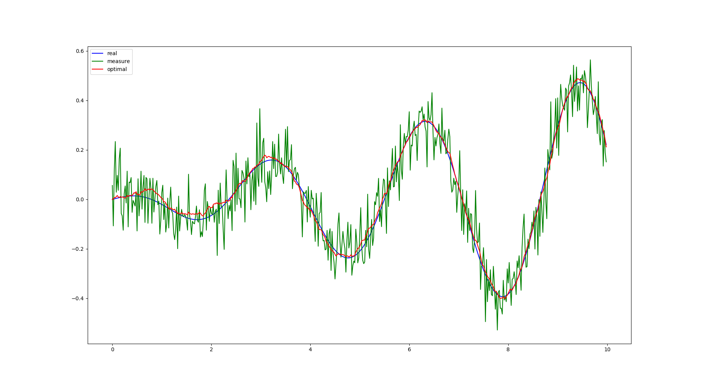

This is a simple implementation of Kalman Filter.

# Dependencies:
- Eigen

# Demo:
to run the demo, run `python3 toy.py` to generate the sample data, then run this command
```
g++ kalman_filter.cpp -g -o test -std=c++11 $(pkg-config --cflags eigen3) &&\
./test && python3 plot.py

```
the visualized result should be like 


# TODO
- add the math derivation
- add UKF, EKF

